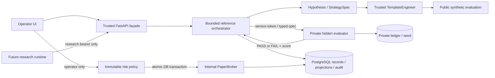

# Архитектура Adaptive Alpha Engine

Ниже сохранено описание основы v0.1. Текущие дополнения v0.3 описаны в [LIFECYCLE.md](LIFECYCLE.md), ограничения v0.2 — в [AUTONOMOUS.md](AUTONOMOUS.md). Эта историческая диаграмма не описывает новые инженерные задания и жизненный цикл.

Три контура из исходной схемы сохранены как границы ответственности. Реализация v0.1 — запускаемая лабораторная основа, а не полный автономный инвестиционный MVP.

| Модуль | Реальная ответственность |
|---|---|
| `domain.py` | Pydantic-контракты, версии, идентификаторы, каноническое хеширование |
| `config.py` | Раздельные identities, чтение mounted secrets, режим demo-paper |
| `store.py` | SQLAlchemy, append-only records, projections, hash-chain events, transaction mutex |
| `data.py` | Синтетический daily fixture, проверка availability и content/schema hash |
| `agents/contracts.py` | Контракты EngineeringAgent, LLMProvider и источников исследований |
| `agents/baseline.py` | Детерминированная гипотеза, шаблон, мутация и crossover |
| `orchestrator.py` | Бюджеты, jobs, attempts, результаты, memory, HTTP к evaluator |
| `evaluation/engine.py` | Lagged returns, costs, public OOS, временные folds, метрики |
| `evaluation/service.py` | Закрытый seed, ledger, лимит запросов, ответ только verdict/score |
| `reproduce.py` | Точная проверка выгруженного public experiment в исходном runtime |
| `risk/engine.py` | Неизменяемая политика и чистая функция pretrade risk |
| `execution.py` | Серверные demo-цены, бумажные fills, idempotency, reconciliation, halt |
| `api/app.py` | HTTP-маршруты, RBAC, security headers, static UI |
| `ui/` | Операторские страницы без сторонних CDN и браузерного хранения токенов |

## Данные и воспроизводимость

Каждый admission создаёт immutable attempt; terminal experiment добавляется отдельно. Изменяемыми остаются только projections состояния jobs, стратегии и paper account. Experiment содержит dataset/feature/protocol versions, seed, dependency lock hash, commit, hash фактического Python source tree, Python version, pinned container base image, spec, template code/hash и время. `make up` подставляет hash uv.lock и Git HEAD в Docker build; `development` явно означает локальную неопределённую provenance. Для повторного публичного расчёта предусмотрен scripts/reproduce.py.

Public synthetic generator и hidden generator одинаковы, но hidden seed и созданные данные доступны только evaluator. Это проверка границы изоляции на demo-данных; она не заменяет защищённую эмпирическую выборку.

## Состояния и ошибки

Jobs: CREATED → RUNNING → COMPLETED / FAILED / CANCELLED / BUDGET_EXHAUSTED. PAUSED зарезервирован контрактом. Начать один job второй раз нельзя. При отмене текущий ограниченный вызов завершается, затем следующий запуск не допускается. При падении процесса остаётся attempt без terminal result; `/api/attempts` позволяет найти его. Автоматического возобновления нет.

Стратегии: RESEARCH → VALIDATED или REJECTED → PAPER только для VALIDATED с operator identity. VALIDATED в demo имеет `synthetic_validation_only=true` и `capital_eligible=false`. Любые более высокие capital states отсутствуют.

Paper orders: APPROVE → FILLED либо REJECT/HALT → REJECTED. Повтор с тем же ID и содержимым возвращает сохранённый ответ. Изменённое содержимое под тем же ID даёт 409. Risk и fill находятся под одной транзакционной блокировкой; network broker отсутствует. При замене на внешний broker потребуются outbox, подписанные ограниченные по времени approvals, частичные fills и независимая сверка.

## Границы защиты

Research bearer не даёт operator endpoints, доступ к портфелю, audit или service token. У API нет hidden seed/volume; у evaluator нет operator/research tokens или public DB. Контейнеры API/evaluator — non-root, read-only, cap-drop, no-new-privileges, CPU/RAM/PID limits. Исследовательскому runtime нельзя выдавать host shell, checkout или Docker socket. Это требование деплоя будущего адаптера, не гарантия безопасности произвольного локального процесса.

PostgreSQL bootstrap использует владельца БД: triggers защищают от обычного UPDATE/DELETE/TRUNCATE, но администратор может удалить trigger. Отдельные migration/runtime роли и WORM anchoring обязательны до эксплуатации с ценными данными. Токены локального стенда bearer; для внешнего доступа нужны TLS, OIDC, ротация и сетевой периметр.
