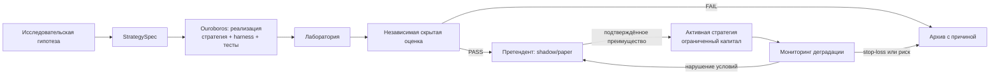

# Целевая операционная модель Adaptive Alpha

Подробный план оставшихся работ, зависимостей и приёмки: [ROADMAP.md](ROADMAP.md).

## Итоговая цель

Adaptive Alpha — автономная, воспроизводимая и управляемая платформа количественных исследований. Она непрерывно превращает проверяемые рыночные гипотезы в версии стратегий, сопоставляет действующие стратегии с претендентами и поддерживает портфель с максимальной ожидаемой доходностью **после издержек** при жёстко ограниченном риске.

Прибыль отдельного backtest не является критерием допуска. Стратегия должна подтвердить преимущество на независимых периодах и в последующем paper/shadow наблюдении; при деградации она уменьшает долю капитала или останавливается. Система не обещает и не может гарантировать прибыль.

## Роли и границы полномочий

| Роль | Полномочие | Запрещено |
|---|---|---|
| Исследовательский агент | Ищет источники, формулирует экономический механизм, гипотезу, условия опровержения и StrategySpec | Реализовывать без проверяемой спецификации; допускать капитал |
| Ouroboros | По утверждённой спецификации создаёт версионированные код стратегии, скиллы, субагентов, harness, тесты и OpenSpec-изменения | Формулировать экономическую ценность стратегии, менять hidden evaluator, risk, права, секреты или капитал |
| Лаборатория | Воспроизводимо запускает backtest, walk-forward и диагностические проверки | Самостоятельно допускать стратегию к капиталу |
| Независимый evaluator | Выполняет закрытую проверку и возвращает ограниченный verdict/evidence | Принимать или изменять код претендента |
| Risk и execution control plane | Проверяет каждую заявку, контролирует позиции, лимиты, сверку и аварийную остановку | Быть изменяемым исследовательскими агентами |
| Оператор | Утверждает переходы между стадиями и policy-версии | Обходить риск и неизменяемый аудит |

## Жизненный цикл стратегии



Каждая модификация создаёт потомка, а не изменяет действующую стратегию. Для любого решения должны сохраняться: родительская версия, StrategySpec, код, lockfile/runtime, набор данных, параметры протокола, результаты, решение о переходе и причина отказа либо отката.

## Исполнение

Стратегия формирует только намерение сделки. Независимый control plane сопоставляет его с актуальным портфелем и данными, применяет risk policy и лишь затем передаёт разрешённую заявку брокерскому адаптеру. Внешнее исполнение строится как отдельный путь:

```text
Стратегия → Intent → Risk Engine → подписанное краткоживущее approval
→ broker outbox → Alpaca Trading API → рынок → reconciliation → immutable audit
```

Alpaca paper и live являются разными профилями, ключами и endpoints. Paper/shadow не даёт права на live. Live-профиль не должен передаваться Ouroboros, исследовательскому агенту или коду стратегии.

## Критерий выбора

Претендент сравнивается с активной стратегией на одинаковых данных и протоколе. Решение учитывает чистую доходность, просадку, риск, оборот, издержки, ликвидность, стабильность по режимам, статистическую надёжность и результаты forward-наблюдения. Портфельный слой распределяет капитал между несколькими прошедшими стратегиями; он не передаёт весь капитал одному победителю backtest.

## Эволюция Ouroboros

Ouroboros развивается по инженерной обратной связи: результатам тестов, ошибкам воспроизведения, недостаткам harness и незакрытым capability gaps. Он может предложить новый скилл или субагента только как изолированный версионированный артефакт с объявленными правами, бюджетом, входами/выходами и набором оценки. Новая версия сравнивается с прежней на идентичном бенчмарке и применяется оператором только после доказанного улучшения.
